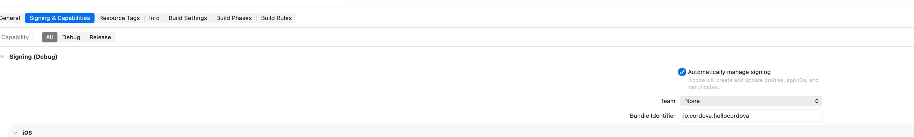

# Creating a QR Code Scanner Cordova Plugin

In this challenge, I set out to create a Cordova plugin for scanning QR codes. I implemented the plugin using Objective-C and Swift, and also enabled interaction between Objective-C and Swift within the plugin.


## How to Run

``` bash
git clone https://github.com/cythb/cordova-plugin.git
cd cordova-plugin
npx cordova platform add ios
npx cordova prepare ios
xed platforms/ios
# update team in buiding settings
# run on an iOS device
```



## Progress

Currently, the iOS QR code scanning feature is fully implemented.
The Android version, however, only prints a string for now and doesn’t include actual logic yet.

### How I Built It

I started by finding a Cordova Plugin Template on GitHub and modifying its configuration.
After reviewing the official Cordova plugin documentation and examples, I noticed that there weren’t many plugins demonstrating how to include third-party library dependencies. I spent some time researching how to achieve this.

By configuring plugin.xml, I was able to generate a valid Podfile and include third-party dependencies using CocoaPods:

```xml
      <podspec>
        <config>
          <source url="https://github.com/CocoaPods/Specs.git"/>
        </config>
        <pods use-frameworks="true">
          <pod name="MercariQRScanner" git="https://github.com/mercari/QRScanner.git" branch="master"/>
        </pods>
      </podspec>
```

To request camera access permissions:

```xml
        <config-file target="*-Info.plist" parent="NSCameraUsageDescription">
          <string>Requires access to camera to scan QR code</string>
        </config-file>
```

To include the source files:

```xml
        <header-file src="src/ios/QRCodeScannerPlugin.h" />
        <source-file src="src/ios/QRCodeScannerPlugin.m" />
        <source-file src="src/ios/QRScannerViewController.swift" />
```

## Another Example of JS–Native Swift Interaction

Years ago, I built another project (zh-web-container)[https://github.com/cythb/zh-web-container/tree/main] that featured a JavaScript–native interaction model similar to Cordova.
Cordova uses a callbackId to send responses back to JavaScript, while my own system used a messageId for the same purpose.


The zh-web-container project also introduced a plugin system with the following implemented plugins:
https://github.com/cythb/zh-web-container/blob/main/document/WebAPI_V0.6.pdf

1.	systemInfo
2.	reLaunch
3.	downloadFile
4.	uploadFile
5.	takePhoto
6.	chooseImage
7.	scanCode
8.	getFileList